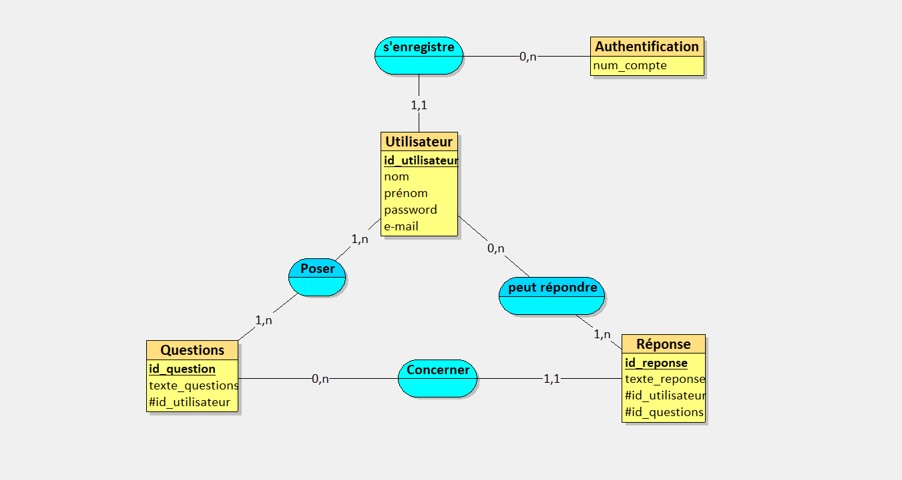
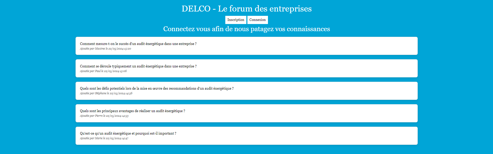
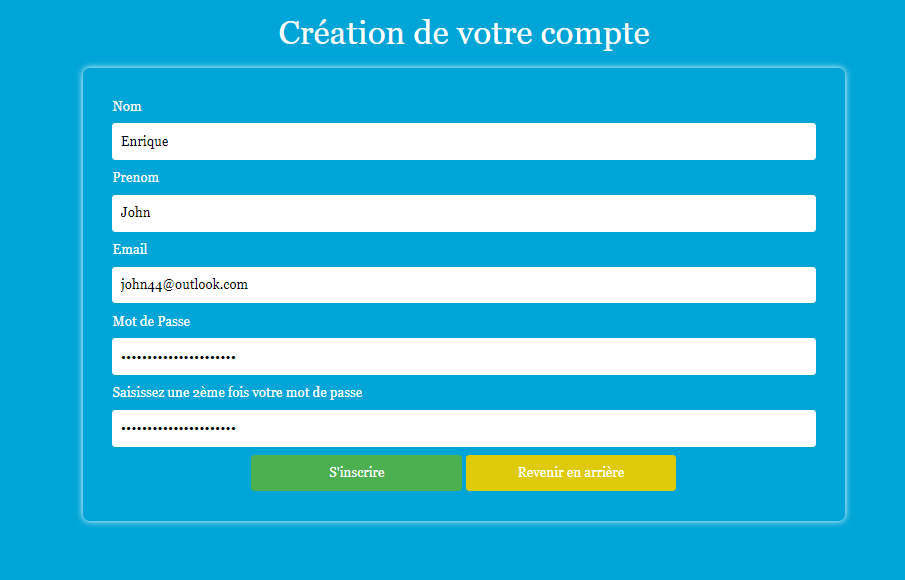
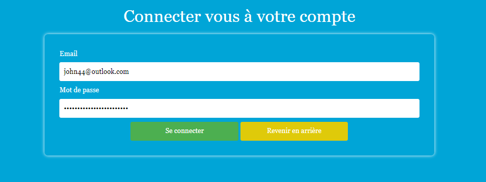
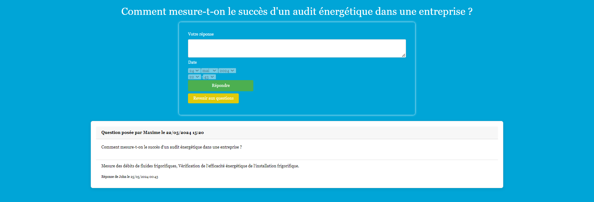
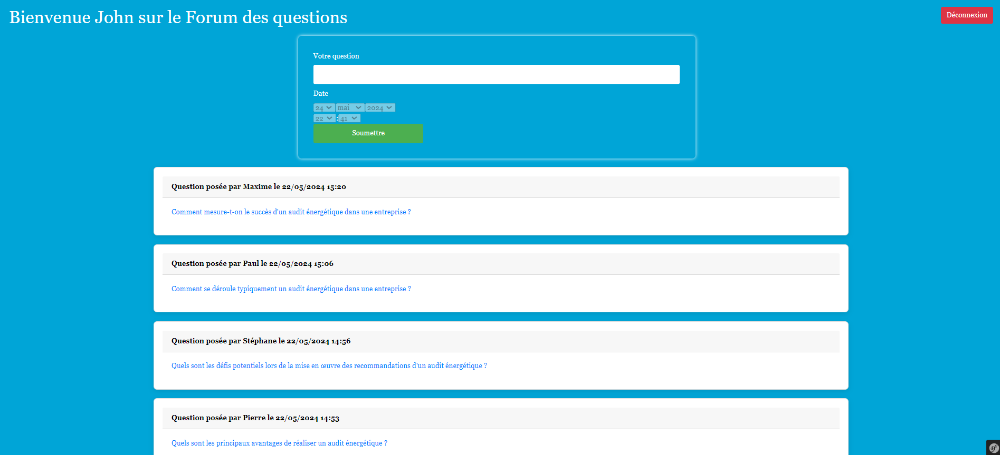

# DELCO 

## Description

DELCO est un projet de forum interne développé pour une entreprise fictive, visant à faciliter les échanges sur des thématiques professionnelles entre employés. 
Le site permet la création de comptes, la connexion des utilisateurs, et offre la possibilité de poser des questions ainsi que de répondre à celles des autres employés.

## Fonctionnalités

- **Création de compte** : Les employés peuvent s'inscrire en fournissant des informations de base.

- **Connexion** : Les utilisateurs peuvent se connecter à leur compte pour accéder aux fonctionnalités du forum.

- **Forum** : Les utilisateurs peuvent créer des sujets de discussion, poser des questions et répondre aux questions posées par d'autres employés.

- **Profil utilisateur** : Chaque utilisateur dispose d'un profil où il peut voir ses activités et ses contributions.

## Technos

Les technologies utilisées pour ce projet sont :

- Laragon / PHP / MySQL
